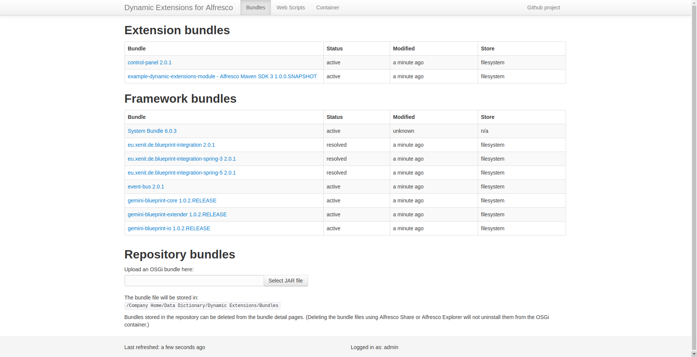

# Alfresco Maven SDK 3 example Dynamic Extensions project

Example project building a custom Dynamic Extensions module with the Alfresco Maven SDK version 3.

## Building
The project can be build with the default `mvn package` command.  
Once build, two artifacts will be available in the `target` folder:

* A Dynamic Extensions OSGi bundle that can be manually uploaded to the Dynamic Extensions dashboard
* An Alfresco Module Package containing the custom bundle, which can be installed in Alfresco using e.g. Alfresco's 
Module Management Tool.

## Starting Alfresco

Since this project is based on the `org.alfresco.maven.archetype:alfresco-platform-jar-archetype` Maven 
archetype, you can use `mvn clean install -DskipTests=true alfresco:run` or `./run.sh` to start it up locally.
 
The starting Alfresco will have Dynamic Extensions and the custom module build by this project, installed. 
Once started up the dashboard is available on http://localhost:8080/alfresco/s/dynamic-extensions/bundles.

   
  
 
